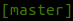
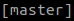
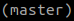
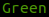
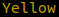

# Git Branch Color Status
version: 1.1.4
status: actively developed

## What is this?

It's a software to inform you the current state of your repository through symbols and colors

## How does it work?

It runs Bash scripts that checks the state of the git repository present on the current directory and displays it through symbols and colors

## Requirements

- [NodeJS](https://nodejs.org) and [NPM](https://www.npmjs.com/)
- [Bash](https://www.gnu.org/software/bash/)

## How to use it?

- Install it by executing `sudo npm install -g git-branch-color-status`
- Configure your PS1 on your .bashrc file like this `PS1+="\$(git-branch-color-status)";`

### Options available

| Option   | Description                                                                  | Type    | Number of  Arguments | Available Arguments          | Default Value | Syntax                                                                                                                                  |
|:--------:|:----------------------------------------------------------------------------:|:-------:|:--------------------:|:----------------------------:|:-------------:|:----------------------------------------------------------------------------------------------------------------------------------------|
| Version  | displays the current version  number and exit                             | Boolean | 0                    | N/A                          | false         | -v  --version                                                                                                                        |
| Color    | enable colored output                                                        | Boolean | 0                    | N/A                          | true          | -c  --color                                                                                                                          |
| No Color | disable colored output                                                       | Boolean | 0                    | N/A                          | false         | --no-c  --no-color                                                                                                                   |
| Bracket  | specify the type of brackets  displayed surrounding the  branch status | String  | 1                    | round,  square,  curly | square        | -b round  -b "round"  -b=round  -b="round"  --bracket round  --bracket "round"  --bracket=round  --bracket="round" |

### Exemples

| Command                                          | Output                                                                                                                                                                 |
|:------------------------------------------------:|:----------------------------------------------------------------------------------------------------------------------------------------------------------------------:|
| `git-branch-color-status`                        |                |
| `git-branch-color-status --no-color`             |            |
| `git-branch-color-status --no-c --bracket=round` |  | 

## Symbols and Colors available

### Symbols available

| Symbol | Description                           |
|:------:|:--------------------------------------|
| `>`    | There are renamed files being tracked |
| `*`    | Your branch is ahead of remote        |
| `+`    | There are new files being tracked     |
| `?`    | There are untracked files             |
| `x`    | There are deleted tracked files       |
| `!`    | There are modified tracked files      |

### Colors available

| Color                                                                    | Description                           |
|:------------------------------------------------------------------------:|---------------------------------------|
|      | Working tree clean, nothing to commit |
|  | Your branch is ahead of remote branch |
|              | Working tree not clean                |

## How to contribute

Fork this project, create a branch, push your changes and make a pull request destined to the master branch
